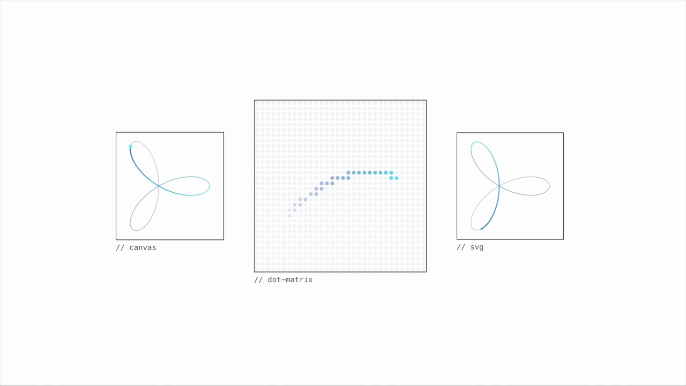

# @sarmal/core

<p align="center">
  <strong>Beautiful animated curves for loading states and ambient motion</strong>
</p>

<div align="center">
  <a href="https://sarmal.art">
    
  </a>
</div>

---

**@sarmal/core** is a lightweight library for animated curves on canvas and SVG.

Use it for loading animations, thinking indicators, ambient decoration — or whatever else you have in mind.

In web applications or directly in your terminal (`npx @sarmal/core`).

- **Canvas, SVG, and dot-matrix renderers**: pick one, or use them all
- **Built-in curves**: roses, Lissajous figures, stars, epitrochoids, and more.
  - You can also draw your own curve with point arrays!
- **TIME CONTROL**: programmatic seeking, speed transitions, and morph between curves
- **Zero dependencies**: tiny bundle (single renderer + one curve, minified + tree-shaken)
- **TypeScript-first**: full type safety, ships with `.d.ts` declarations

## Install

```bash
npm install @sarmal/core
```

Or use directly from CDN:

```html
<script type="module">
  import { createSarmal, rose3 } from "https://cdn.jsdelivr.net/npm/@sarmal/core/+esm";
  // your code here
</script>
```

## Quick Start

```javascript
import { createSarmal, rose3 } from "@sarmal/core";

const canvas = document.getElementById("my-canvas");
const sarmal = createSarmal(canvas, rose3, {
  trailLength: 30,
  trailColor: "#00ffaa",
  trailWidth: 2,
});

sarmal.play();
```

Or with **auto-init** without having to write any JS:

```html
<script src="https://cdn.jsdelivr.net/npm/@sarmal/core/dist/auto-init.js"></script>
<canvas data-sarmal="rose3" width="200" height="200"></canvas>
```

## Standard Curves

See [sarmal.art/docs/curves](https://sarmal.art/docs/curves) for the full list of built-in curves.

## Documentation

Full API reference, examples, SVG renderer usage, engine time control (`seek`, `seekWithTrail`), custom curve definitions, and framework guides are available at [sarmal.art/docs](https://sarmal.art/docs)

## Inspiration

Inspired by [@bbssppllvv's tweet](https://x.com/bbssppllvv/status/2038718410318659763)

## License

MIT © [Alper Halil](https://aktasalper.com)

## Links

- [Homepage](https://sarmal.art): See all curves in action
- [npm](https://www.npmjs.com/package/@sarmal/core): Package registry
